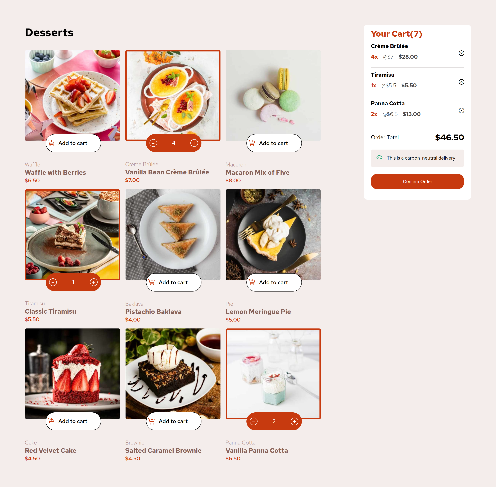

# Frontend Mentor - Product list with cart solution

This is a solution to the [Product list with cart challenge on Frontend Mentor](https://www.frontendmentor.io/challenges/product-list-with-cart-5MmqLVAp_d). Frontend Mentor challenges help you improve your coding skills by building realistic projects. 

## Table of contents

- [Overview](#overview)
  - [The challenge](#the-challenge)
  - [Screenshot](#screenshot)
  - [Links](#links)
  - [Built with](#built-with)
  - [What I learned](#what-i-learned)
- [Author](#author)

## Overview

This project is a simple front-end application featuring a product list with a cart system. Users can browse through a list of products, add items to the cart, and view the total cost dynamically. Built as a practice project, it focuses on leveraging core JavaScript and DOM manipulation to create an interactive and functional shopping experience.

### The challenge

Users should be able to:

- Add items to the cart and remove them
- Increase/decrease the number of items in the cart
- See an order confirmation modal when they click "Confirm Order"
- Reset their selections when they click "Start New Order"
- View the optimal layout for the interface depending on their device's screen size
- See hover and focus states for all interactive elements on the page

### Screenshot

### Links

- Solution URL: [solution URL](https://github.com/nickonyi/product-list-with-cart-main.git)
- Live Site URL: [Add live site URL here](https://your-live-site-url.com)

### Built with

- Semantic HTML5 markup
- CSS custom properties
- Flexbox
- CSS Grid
- Mobile-first workflow
- Webpack

## What I Learned

This project served as an excellent practice ground for enhancing my knowledge of the Document Object Model (DOM). Through this exercise, I improved my skills in dynamically manipulating HTML elements, handling events, and creating an interactive and responsive user interface. It also helped me gain a deeper understanding of JavaScript's role in building dynamic web applications.

## Author
- Frontend Mentor - [@nick_onyi](https://www.frontendmentor.io/profile/nickonyi)

